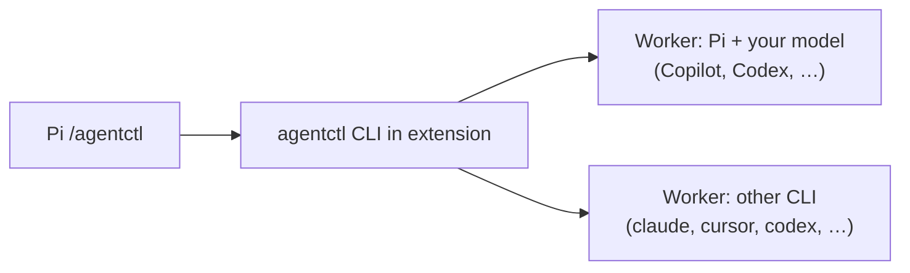
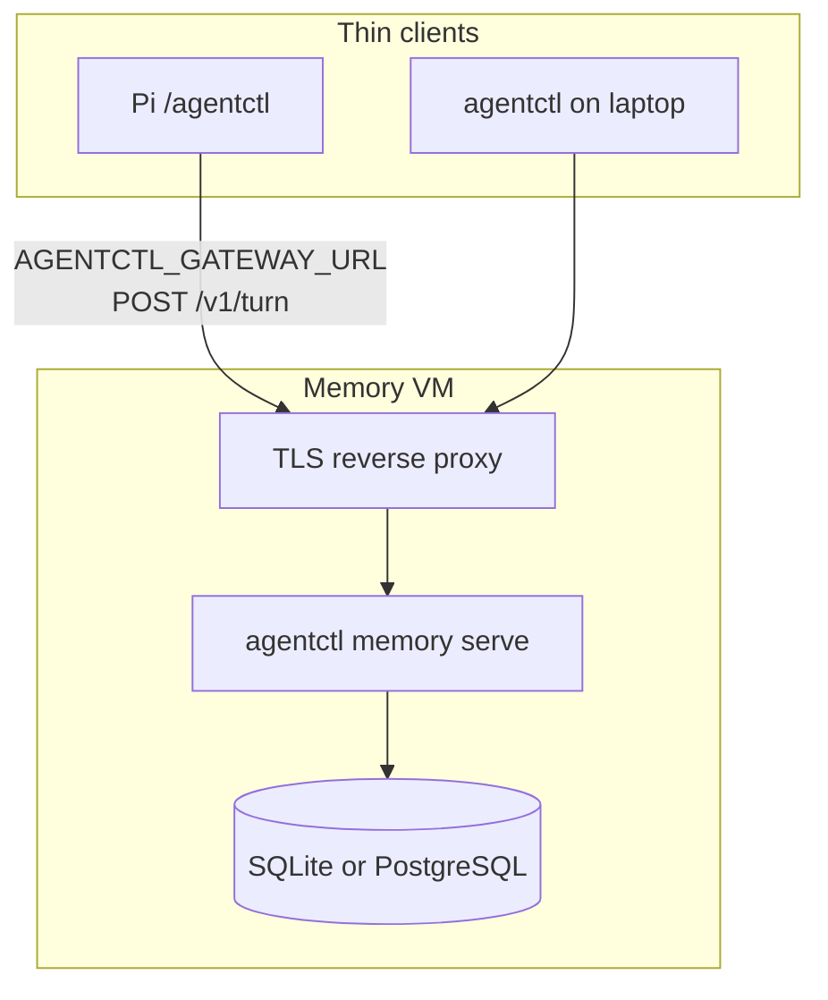

# agentctl

**Pi extension and CLI** for delegating work to **your** agent subscriptions — GitHub Copilot, OpenAI Codex, Anthropic, Cursor, or any backend you configure in [`src/adapters/presets`](src/adapters/presets). agentctl routes tasks, bounds multi-step plans, and optionally connects to a **team memory gatekeeper** over HTTP.

Full phased deploy (VM, Postgres, SessionGraph): [`docs/STACK-SETUP.md`](docs/STACK-SETUP.md).

## Install (Pi)

Requires [Pi](https://github.com/badlogic/pi-mono/tree/main/packages/coding-agent) and Node.js 20+. Authenticate the providers you use in Pi (for example **GitHub Copilot** or Codex) before running live tasks.

```sh
pi install npm:@lifetimescriptkiddie/agentctl
```

Reload Pi, then:

```text
/agentctl
/agentctl health
/agentctl delegate explain this function
/agentctl delegate --to pi --model <your-copilot-or-provider-model> "summarize this module"
/agentctl ask --to pi --model openai-codex/gpt-5.6-luna "what does this test cover?"
/agentctl orchestrate review this package
```

The extension bundles its own CLI (no separate global install required). **`delegate`** and **`ask`** run one worker with the agent and model you choose. **`orchestrate`** previews a plan by default; **`/agentctl orchestrate --run …`** executes and can spend quota on **your** subscription — use **`--budget`** and **`--max-replans`**.

Pick models explicitly with **`--to`** and **`--model`**. Defaults in shipped presets are examples only; **`agentctl agents list`** shows configured lanes. **`agentctl delegate --dry-route --explain "…"`** shows routing without calling a provider.

Synthetic check with no live provider:

```sh
agentctl ask --to dry_run "hello" --format json
```

### Standalone CLI (optional)

```sh
npm install -g @lifetimescriptkiddie/agentctl
agentctl --help
```

Same commands as Pi; useful in CI or when Pi is not running.

## Models and subscriptions

You designate the worker:

| You have | Typical Pi / agentctl usage |
| --- | --- |
| **GitHub Copilot** | Sign in to Copilot in Pi; pass **`--to pi --model <id>`** where **`<id>`** is a Copilot-capable model from **`pi models`** (or your Pi config). |
| **OpenAI Codex / other Pi providers** | **`--to pi --model openai-codex/…`** (or your provider prefix). |
| **Another installed CLI** | **`--to claude`**, **`--to cursor`**, **`--to codex`**, etc., with **`--model`** for that CLI’s catalog. |

agentctl does not grant model access — only routes to CLIs already signed in on your machine. Curated routing tables in [MODEL-ROUTING.md](docs/MODEL-ROUTING.md) are **optional defaults** for mixed teams; override anytime with explicit flags. See [INTEGRATIONS.md](docs/INTEGRATIONS.md) for Pi commands, gatekeeper env vars, and memory routes.

## Architecture

### On your machine (Pi + workers)



Pi owns intent and approvals. agentctl picks a lane, spawns the subprocess worker, and returns results to the chat. Workers inherit your local credentials for that provider.

### Team memory (optional)

For shared Q&A, use **one Linux VM** as the only writer to the memory database. Laptops and Pi stay **thin clients** — HTTP to the gatekeeper, not SSH per question.



| Client env | Purpose |
| --- | --- |
| **`AGENTCTL_GATEWAY_URL`** | Gatekeeper base URL for **`POST /v1/turn`** (JIT context + optional central model). |
| **`AGENTCTL_BRIEFING_WORKSPACE`** | Workspace id for team memory. |
| **`AGENTCTL_USER_ID`** / **`AGENTCTL_GROUPS`** / **`AGENTCTL_CLEARANCE`** | Auth headers for filtered retrieval. |

Proposed memories flow **propose → human review → accept** on the server. Nightly usage analysis can export to [SessionGraph](https://github.com/LifeTimeScriptKiddie/sessiongraph) — see [SESSIONGRAPH-NIGHTLY.md](docs/SESSIONGRAPH-NIGHTLY.md). HTTP route table: [TURN-GRAPH.md](docs/TURN-GRAPH.md), [INTEGRATIONS.md](docs/INTEGRATIONS.md).

## Local memory (single user)

**`agentctl memory --help`** — opt-in save, review, accept, search, and handoff under **`~/.agentctl/memory/`** (or **`AGENTCTL_HOME`**). Requires Node with **`node:sqlite`**. In Pi: **`/reload`**, then **`/agentctl memory-test`** for an isolated synthetic lifecycle (uses your configured worker models, up to three calls).

## Token usage

**`agentctl usage`** — persistent provider-reported counters by agent and model (no prompt text). See [USAGE.md](docs/USAGE.md).

## Local agent monitoring (macOS)

Read-only snapshot of observed agent processes and loopback listeners (former AgentWatch collectors):

```bash
agentctl monitor --once --json
agentctl watch --interval 5
```

Requires macOS **`ps`**, **`lsof`**, **`nettop`**. Not billing data. Details unchanged in package docs; library exports **`collectMonitorOutput`** from the package root.

## Configuration

Presets live under **`src/adapters/presets`**. Copy and adjust for your org’s CLIs and model ids. Browser adapter is optional (Playwright + CDP). See **`agentctl --help`** and subcommand **`--help`**.

## Privacy and trust

Prompts go to the backend you select. State may persist under **`~/.agentctl`** (sessions, usage ledger, optional memory). Capability checks are not an OS sandbox. This repository ships source and synthetic tests only — no personal sessions or credentials.

Browser evidence requires **`AGENTCTL_CAPTURE_EVIDENCE=1`**. Review before sharing captures.

## Development

```sh
npm ci --ignore-scripts
npm run build
npm run typecheck
npm test
```

Respect a 14-day dependency publication cooldown when refreshing the lockfile.

## License

MIT. Dependencies remain under their respective licenses.
