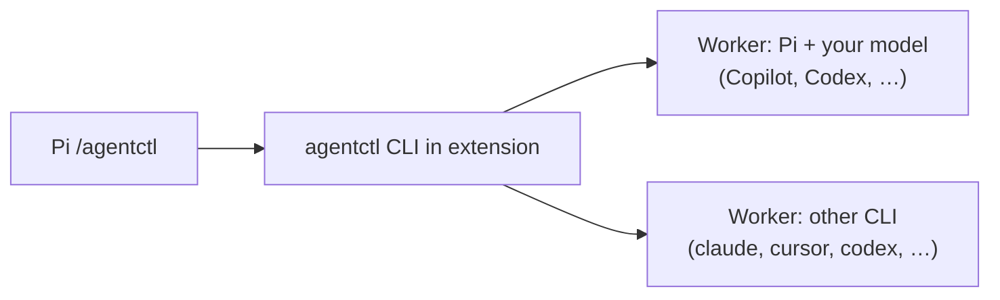
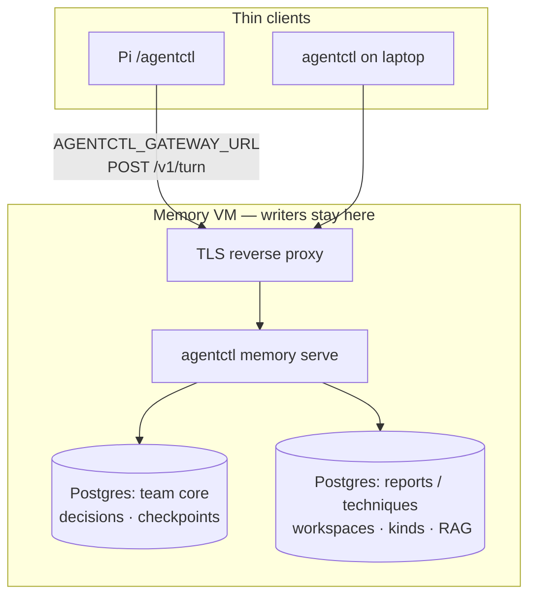

# agentctl

**Pi extension and CLI** for delegating work to **your** agent subscriptions — GitHub Copilot, OpenAI Codex, Anthropic, Cursor, or any backend you configure in [`src/adapters/presets`](src/adapters/presets). agentctl routes tasks, bounds multi-step plans, and optionally connects to a **[team memory gatekeeper](#team-shared-knowledge-domain)** over HTTP (shared knowledge domain — workspaces, human accept, ACL-filtered retrieval).

Full phased deploy (VM, Postgres, SessionGraph): [`docs/STACK-SETUP.md`](docs/STACK-SETUP.md).

## Install (Pi)

Requires [Pi](https://github.com/badlogic/pi-mono/tree/main/packages/coding-agent) and Node.js 20+. Authenticate the providers you use in Pi (for example **GitHub Copilot** or Codex) before running live tasks.

```sh
pi install npm:@lifetimescriptkiddie/agentctl
```

Reload Pi, then:

```text
/agentctl
/agentctl health
/agentctl delegate explain this function
/agentctl delegate --to pi --model <your-copilot-or-provider-model> "summarize this module"
/agentctl ask --to pi --model openai-codex/gpt-5.6-luna "what does this test cover?"
/agentctl orchestrate review this package
```

The extension bundles its own CLI (no separate global install required). **`delegate`** and **`ask`** run one worker with the agent and model you choose. **`orchestrate`** previews a plan by default; **`/agentctl orchestrate --run …`** executes and can spend quota on **your** subscription — use **`--budget`** and **`--max-replans`**.

Pick models explicitly with **`--to`** and **`--model`**. Defaults in shipped presets are examples only; **`agentctl agents list`** shows configured lanes. **`agentctl delegate --dry-route --explain "…"`** shows routing without calling a provider.

Synthetic check with no live provider:

```sh
agentctl ask --to dry_run "hello" --format json
```

### Standalone CLI (optional)

```sh
npm install -g @lifetimescriptkiddie/agentctl
agentctl --help
```

Same commands as Pi; useful in CI or when Pi is not running.

## Models and subscriptions

You designate the worker:

| You have | Typical Pi / agentctl usage |
| --- | --- |
| **GitHub Copilot** | Sign in to Copilot in Pi; pass **`--to pi --model <id>`** where **`<id>`** is a Copilot-capable model from **`pi models`** (or your Pi config). |
| **OpenAI Codex / other Pi providers** | **`--to pi --model openai-codex/…`** (or your provider prefix). |
| **Another installed CLI** | **`--to claude`**, **`--to cursor`**, **`--to codex`**, etc., with **`--model`** for that CLI’s catalog. |

agentctl does not grant model access — only routes to CLIs already signed in on your machine. Curated routing tables in [MODEL-ROUTING.md](docs/MODEL-ROUTING.md) are **optional defaults** for mixed teams; override anytime with explicit flags. See [INTEGRATIONS.md](docs/INTEGRATIONS.md) for Pi commands, gatekeeper env vars, and memory routes.

## Architecture

### On your machine (Pi + workers)



Pi owns intent and approvals. agentctl picks a lane, spawns the subprocess worker, and returns results to the chat. Workers inherit your local credentials for that provider.

### Team memory (optional)

For shared Q&A, use **one Linux VM** as the **only host that opens team databases** (SQLite or PostgreSQL). Laptops and Pi stay **thin clients** — HTTP to the gatekeeper, not SSH per question. That VM often runs **more than one database** (or more than one workspace plane) so reports, techniques, CVE tracking, and approved team claims stay separated while sharing one TLS front door.



| Client env | Purpose |
| --- | --- |
| **`AGENTCTL_GATEWAY_URL`** | Gatekeeper base URL for **`POST /v1/turn`** (JIT context + optional central model). |
| **`AGENTCTL_BRIEFING_WORKSPACE`** | Which **domain** to query (`team-atlas`, `team-reports`, `team-techniques`, …). |
| **`AGENTCTL_USER_ID`** / **`AGENTCTL_GROUPS`** / **`AGENTCTL_CLEARANCE`** | Auth headers for filtered retrieval. |

See [Storage on the memory VM](#storage-on-the-memory-vm-one-host-multiple-planes) under the team domain section. Deploy: [POSTGRES-MEMORY.md](docs/POSTGRES-MEMORY.md), [STACK-SETUP.md](docs/STACK-SETUP.md).

Proposed memories flow **propose → human review → accept** on the server. Details: [Team shared knowledge domain](#team-shared-knowledge-domain) below. Nightly usage analysis can export to [SessionGraph](https://github.com/LifeTimeScriptKiddie/sessiongraph) — see [SESSIONGRAPH-NIGHTLY.md](docs/SESSIONGRAPH-NIGHTLY.md). HTTP route table: [TURN-GRAPH.md](docs/TURN-GRAPH.md), [INTEGRATIONS.md](docs/INTEGRATIONS.md).

## Team shared knowledge domain

This is the **durable, team-owned layer** agents may read during work — not chat transcripts, not automatic “remember everything,” and not a replacement for your git repo or wiki. It holds **short claims** your team has chosen to treat as shared context: decisions, runbooks, CVE notes, report conclusions, explicit preferences.

Everything lives in a **workspace** (string id, e.g. `team-atlas`, `team-reports`, `team-techniques`, `team-sec-cve`). Workspaces isolate retrieval: a query and write always name one workspace. The shipped **kind registry** (`$AGENTCTL_HOME/config/memory-kinds.yaml`) maps **kinds** to default workspaces — extend it for your domains (reports, techniques, CVEs, runbooks):

| Kind (examples) | Typical workspace | Content |
| --- | --- | --- |
| `decision` | `team-atlas` | Approved team choices, owners, rollback policy |
| `report` | `team-reports` | Engagement summaries, conclusions, scope notes |
| `process` | `team-ops` | Runbooks, on-call steps |
| `cve` | `team-sec-cve` | Advisory tracking, vendor fix status |
| `technique` | `team-techniques` | TTP notes, tool usage (custom kind — add in YAML) |
| `preference` | (per team) | Explicit operator preferences |

Kinds are not separate databases by themselves; they label rows and drive briefing defaults. **Physical separation** is done with workspaces and/or separate Postgres databases on the same VM (below).

### Storage on the memory VM (one host, multiple planes)

**One Linux VM** is enough for production: a single TLS edge and one or more **`agentctl memory serve`** processes. Clients still never mount database files or SSH for Q&A.

| Plane | Engine | What it holds | Governance |
| --- | --- | --- | --- |
| **Team memory** | SQLite (small) or **PostgreSQL** (team prod) | Versioned **claims** in `memories` — decisions, report takeaways, technique notes, checkpoints | **Propose → human accept** before search/briefing |
| **Workspace domains** | Same DB | Logical split: `team-reports`, `team-techniques`, `team-sec-cve`, … — each query/write names one workspace | Same ACL + accept rules per row |
| **RAG / corpus** | PostgreSQL `rag_documents` (migration `002_search.sql`) | Longer report bodies, technique libraries, pasted reference text | **Import + ACL** — not the same lifecycle as every short claim; schema ships today; gatekeeper wiring evolves |
| **Usage / audit** | Files under `$AGENTCTL_HOME` | `logs/memory-serve-audit.jsonl`, SessionGraph export JSON | Ops telemetry, not agent briefing |

**PostgreSQL on the VM (typical team setup)**

```bash
export AGENTCTL_MEMORY_BACKEND=postgres
export AGENTCTL_MEMORY_DATABASE_URL=postgres://agentctl@127.0.0.1:5432/team_memory
agentctl memory postgres migrate
agentctl memory serve --host 127.0.0.1 --port 8741
```

One database URL = one store behind a given `memory serve`. To **hard-separate** reports vs techniques at the DB layer, common patterns on the **same VM**:

1. **Single Postgres, multiple workspaces** (simplest) — one URL, many workspaces/kinds; backup once; ACL on every row.
2. **Multiple Postgres databases** — e.g. `team_reports`, `team_techniques`, each with its own `AGENTCTL_HOME` + `memory serve` on a different loopback port; Caddy routes `https://memory.example.com/reports` vs `/techniques` to different backends; clients set different **`AGENTCTL_GATEWAY_URL`** / **`AGENTCTL_BRIEFING_WORKSPACE`**.
3. **SQLite per domain** (dev only) — separate `$AGENTCTL_HOME` trees; not for multi-client prod.

Thin clients remain dumb: they only pass **workspace**, **query**, and **auth headers**; the gatekeeper chooses candidates from the store bound to that serve instance.

Migrations and tables: [POSTGRES-MEMORY.md](docs/POSTGRES-MEMORY.md) (`memories`, `revisions`, `task_checkpoints`, optional `rag_documents`).

### What a memory is

Each record is a **versioned text claim** plus metadata:

| Field | Meaning |
| --- | --- |
| **text** | The claim agents may see (keep it concise; link out to docs for detail). |
| **kind** | Category from the registry — defaults include `decision`, `cve`, `report`, `process`, `preference`; add **`technique`** (or others) in YAML for your domains. |
| **state** | `proposed` (not in search/briefing) or `accepted` (durable team knowledge). |
| **revision** | Increments on edit; accept/correct must target the current revision. |
| **source** | Provenance label (ticket, meeting, `pi:…`, etc.) — data, not proof of truth. |
| **providers** | Which worker lanes may use this memory in briefing (e.g. `pi`, `cursor`, `laya`). |
| **classification** | `public` / `internal` / `confidential` — compared to the caller’s clearance. |
| **visibility** | `team` (shared) or `private` (only owner user id). |
| **allowed_groups** | If non-empty, caller must be in at least one group (with clearance). |

**Forgotten** memories remain in history but drop out of search and briefing.

### Governance: nothing becomes team knowledge by accident

Writes use a **separate write graph** from reads (`POST /v1/turn` never commits memory).

```text
propose  →  human review  →  accept (human_approved: true)
                ↘ reject / correct / forget
```

- **Propose:** agent or operator suggests a claim (`agentctl memory write --mode propose`, Pi `/agentctl memory-write`, or `POST /v1/memory/write`).
- **Review:** queue of `proposed` rows (`memory review`, `GET /v1/memory/review`, Pi `/agentctl memory-review`).
- **Accept:** explicit human approval only (`memory accept`, `POST /v1/memory/accept`). Until then, FTS and briefing **exclude** the row.

An operator saying “remember this” in chat **does not** bypass accept — only the supplied claim, with approval, becomes `accepted`.

### Who sees what (access control)

On the gatekeeper, set identity on each client:

```bash
export AGENTCTL_USER_ID=alice@example.com
export AGENTCTL_GROUPS=atlas-eng,oncall
export AGENTCTL_CLEARANCE=internal   # public | internal | confidential
```

HTTP headers: `x-agentctl-user-id`, `x-agentctl-groups`, `x-agentctl-clearance`. Without `AGENTCTL_USER_ID`, auth trim is off (single-user dev only).

**Read path order:** workspace scope → full-text candidates → **ACL filter** → optional evidence gate → byte limits. Clearance is enforced **before** ranking; private memories never leak via “helpful” reranking.

### How agents read (context bundle)

Thin clients do **not** open SQLite/Postgres. They call the gatekeeper:

1. **`POST /v1/turn`** — preferred for Pi/`delegate`/`ask` when `AGENTCTL_GATEWAY_URL` is set. Returns a **context bundle** (and optionally runs a central model on the VM if configured).
2. **`POST /v1/context`** — legacy briefing-shaped packet; same retrieval graph underneath.

Retrieval runs the **context_retrieval** turn graph: scope → FTS → ACL → optional [Laya](docs/LAYA-MEMORY.md) or [Jev](docs/JEV-MEMORY.md) evidence → limit. Keyword hits without evidence are labeled **not semantically verified** — treat them as hints, not ground truth.

Injected context is **prefix text** for the worker you chose (Copilot via Pi, Codex, etc.); the gatekeeper does not pick your subscription model unless you enable **`AGENTCTL_SERVE_MODEL_AGENT`** on the VM.

### Checkpoints vs memory

| | **Checkpoint** | **Accepted memory** |
| --- | --- | --- |
| Purpose | “Where we left off” on a task | Durable team fact or decision |
| Approval | Provisional; no accept queue | Requires human **accept** |
| CLI | `memory checkpoint show/set` | `memory save` / write graph |
| Briefing | Resume state + linked decision refs | FTS + ACL + optional evidence |

Use checkpoints for session handoff; use **accepted** memories for things the whole team should rely on next month.

### Operator commands (Pi and CLI)

| Intent | Pi (examples) | CLI |
| --- | --- | --- |
| Q&A with team context | Set `AGENTCTL_GATEWAY_URL`, then `/agentctl delegate …` | `agentctl delegate --briefing-workspace team-atlas "…"` |
| Review proposals | `/agentctl memory-review` | `agentctl memory gateway review --workspace …` |
| Propose | `/agentctl memory-write …` | `agentctl memory write --mode propose …` |
| Accept | `/agentctl memory-accept …` | `agentctl memory gateway accept …` |
| Local pilot / test | `/agentctl memory-test` | `agentctl memory test` |
| Resume without model | `/agentctl briefing --workspace …` | `agentctl memory briefing --workspace …` |

Full HTTP and env tables: [INTEGRATIONS.md](docs/INTEGRATIONS.md). Graph audit: [TURN-GRAPH.md](docs/TURN-GRAPH.md). Postgres on the VM: [POSTGRES-MEMORY.md](docs/POSTGRES-MEMORY.md).

### What agents must not do

- SSH **`agentctl memory remote`** for every user question — use **`AGENTCTL_GATEWAY_URL`** and **`POST /v1/turn`**.
- Treat **proposed** or **keyword** hits as approved policy.
- Let subprocess workers mutate memory (nested delegation is blocked).
- Promote Laya/Jev “confidence” to authorization — evidence gates **select** among ACL-safe candidates; humans still **accept** writes.

## Local memory (single user)

Same **memory model** (workspaces, kinds, propose/accept) but stored only on your machine under **`~/.agentctl/memory/`** — no team gatekeeper. Use this to learn the CLI and Pi **`memory-test`** before pointing at a shared VM.

Requires Node with **`node:sqlite`**. **`agentctl memory --help`** for save, review, accept, search, handoff, checkpoint, and briefing. In Pi: **`/reload`**, then **`/agentctl memory-test`** (isolated synthetic lifecycle, up to three worker calls).

## Token usage

**`agentctl usage`** — persistent provider-reported counters by agent and model (no prompt text). See [USAGE.md](docs/USAGE.md).

## Local agent monitoring (macOS)

Read-only snapshot of observed agent processes and loopback listeners (former AgentWatch collectors):

```bash
agentctl monitor --once --json
agentctl watch --interval 5
```

Requires macOS **`ps`**, **`lsof`**, **`nettop`**. Not billing data. Details unchanged in package docs; library exports **`collectMonitorOutput`** from the package root.

## Configuration

Presets live under **`src/adapters/presets`**. Copy and adjust for your org’s CLIs and model ids. Browser adapter is optional (Playwright + CDP). See **`agentctl --help`** and subcommand **`--help`**.

## Privacy and trust

Prompts go to the backend you select. State may persist under **`~/.agentctl`** (sessions, usage ledger, optional memory). Capability checks are not an OS sandbox. This repository ships source and synthetic tests only — no personal sessions or credentials.

Browser evidence requires **`AGENTCTL_CAPTURE_EVIDENCE=1`**. Review before sharing captures.

## Development

```sh
npm ci --ignore-scripts
npm run build
npm run typecheck
npm test
```

Respect a 14-day dependency publication cooldown when refreshing the lockfile.

## License

MIT. Dependencies remain under their respective licenses.
