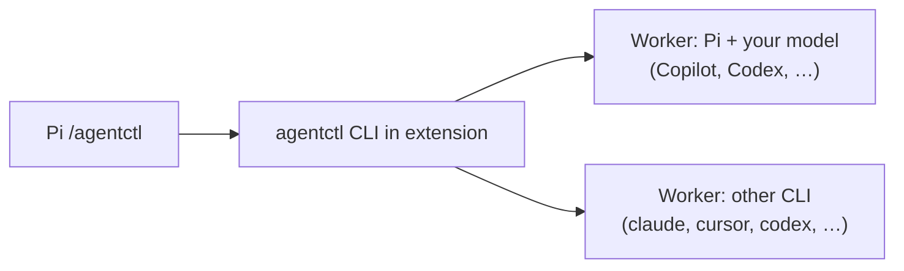
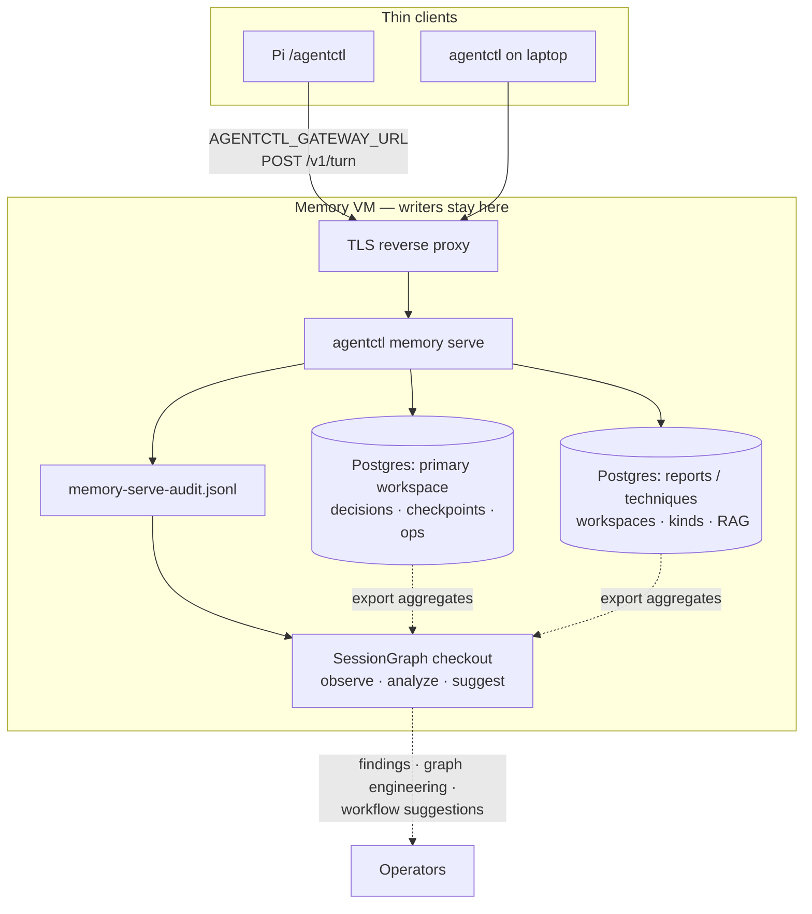
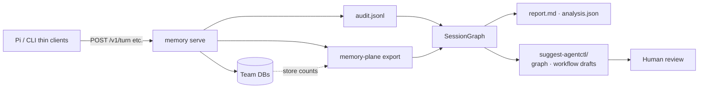

# agentctl

**Pi extension and CLI** built around **multi-subscription orchestration**: one entry point (`/agentctl`, `agentctl delegate`, `agentctl orchestrate`) that routes work to **your** signed-in agents — GitHub Copilot via Pi, OpenAI Codex, Anthropic Claude, Cursor, or any backend in [`src/adapters/presets`](src/adapters/presets). You pick the subscription and model with **`--to`** / **`--model`**; agentctl handles lane selection, bounded plans, and worker subprocesses without merging billing or credentials across providers.

The project **started there** (route · ask · delegate · orchestrate across CLIs). It **grew** optional layers on the same core:

| Layer | What it adds |
| --- | --- |
| **Orchestration** (core) | Multi-step plans, dry-run routing, recursion limits, Pi + standalone CLI |
| **[Agent integration](docs/AGENT-INTEGRATION.md)** | `agentctl mcp` tool server for Claude Code, Cursor, Codex; durable `agentctl jobs` for long runs; caller exclusion; approval stays with the human |
| **[Team memory](#team-shared-knowledge-domain)** | Linux VM gatekeeper, workspaces, propose → accept, ACL-filtered **`POST /v1/turn`** |
| **Storage (modular)** | Pluggable SQLite/Postgres backends; add **workspaces, kinds, or whole databases** on the VM without changing Pi/CLI clients |
| **[SessionGraph](#sessiongraph-on-the-backend-observe--suggest)** | Backend observer — audit + store flow → findings, **graph-engineering** hints, workflow suggestions |
| **Usage & monitor** | [`agentctl usage`](docs/USAGE.md) token ledger; macOS `agentctl monitor` (read-only agent snapshot in README below) |

**Using agentctl from another agent** (Claude Code, Cursor, Codex, Pi): see [`docs/AGENT-INTEGRATION.md`](docs/AGENT-INTEGRATION.md). The interactive `agentctl chat` is kept working but frozen; new work goes into the headless orchestrator.

Nothing beyond orchestration is required for a single developer with Pi and one provider. Turn on memory and SessionGraph when the team needs shared, reviewed knowledge on a central VM.

Deploy walkthrough (VM, Postgres, nightly analysis): [`docs/STACK-SETUP.md`](docs/STACK-SETUP.md).

## Install (Pi)

Requires [Pi](https://github.com/badlogic/pi-mono/tree/main/packages/coding-agent) and Node.js 20+. Authenticate the providers you use in Pi (for example **GitHub Copilot** or Codex) before running live tasks.

```sh
pi install npm:@lifetimescriptkiddie/agentctl
```

Then detect which agent CLIs you have signed in and pick models (or let agentctl optimize):

```sh
agentctl setup          # interactive: choose orchestrator + per-agent defaults
agentctl setup --auto   # non-interactive: probe PATH and pick economical defaults
agentctl setup --show   # inspect preferences + live availability
```

Preferences land in `~/.agentctl/preferences.yaml` and drive default `--orchestrator` / worker models. Per-command `--to` / `--model` still override.

Reload Pi, then:

```text
/agentctl
/agentctl health
/agentctl delegate explain this function
/agentctl delegate --to pi --model <your-copilot-or-provider-model> "summarize this module"
/agentctl ask --to pi --model openai-codex/gpt-5.6-luna "what does this test cover?"
/agentctl orchestrate review this package
```

The extension bundles its own CLI (no separate global install required). **`delegate`** and **`ask`** run one worker with the agent and model you choose. **`orchestrate`** previews a plan by default; **`/agentctl orchestrate --run …`** executes and can spend quota on **your** subscription — use **`--budget`** and **`--max-replans`**.

Pick models explicitly with **`--to`** and **`--model`**. Defaults in shipped presets are examples only; **`agentctl agents list`** shows configured lanes. **`agentctl delegate --dry-route --explain "…"`** shows routing without calling a provider.

Synthetic check with no live provider:

```sh
agentctl ask --to dry_run "hello" --format json
```

### Standalone CLI (optional)

`agentctl chat` uses a conversational lead that answers directly and delegates useful
subtasks to enabled agents. Sessions and task handoffs are saved by default; use
`agentctl chat --resume` to continue in the same directory. `/tasks` shows handoffs,
and `/flow` locates the content-free SessionGraph trace. Full orchestration is opt-in.
See [the chat guide](docs/CHAT.md) for modes, approvals, limits and local flow analysis.

```sh
npm install -g @lifetimescriptkiddie/agentctl
agentctl setup --auto    # or interactive: agentctl setup
agentctl --help
```

Same commands as Pi; useful in CI or when Pi is not running. Install prints a reminder to run setup when `preferences.yaml` is missing (and warns if `AGENTCTL_HOME` looks like a leftover test path).

### From Cursor / Claude / Codex (skill + CLI)

These IDEs are cockpits, not silent wrappers. Load the **agentctl skill**, then **shell out** to the CLI — do not reimplement routing or memory in-process.

| Client | How |
| --- | --- |
| **Pi** | `/agentctl …` (slash extension) |
| **Cursor / Claude / Codex** | Skill [`docs/CURSOR-INVOCATION.md`](docs/CURSOR-INVOCATION.md) + skill path `~/code/skillz/ai-agents/agentctl` (or `~/.cursor/skills/agentctl` / `~/.claude/skills/agentctl`) → run `agentctl delegate` / `ask` / `orchestrate` / `memory` / `setup` |

Prefer `delegate --dry-route` before spending quota. Never nest `agentctl` inside an agentctl worker (`AGENTCTL_WORKER_DEPTH`).

## Models and subscriptions

You designate the worker:

| You have | Typical Pi / agentctl usage |
| --- | --- |
| **GitHub Copilot** | Sign in to Copilot in Pi; pass **`--to pi --model <id>`** where **`<id>`** is a Copilot-capable model from **`pi models`** (or your Pi config). |
| **OpenAI Codex / other Pi providers** | **`--to pi --model openai-codex/…`** (or your provider prefix). |
| **Another installed CLI** | **`--to claude`**, **`--to cursor`**, **`--to codex`**, etc., with **`--model`** for that CLI’s catalog. |

agentctl does not grant model access — only routes to CLIs already signed in on your machine. Curated routing tables in [MODEL-ROUTING.md](docs/MODEL-ROUTING.md) are **optional defaults** for mixed teams; override anytime with explicit flags. See [INTEGRATIONS.md](docs/INTEGRATIONS.md) for Pi commands, gatekeeper env vars, and memory routes.

## Architecture

### On your machine (Pi + workers)



Pi owns intent and approvals. agentctl picks a lane, spawns the subprocess worker, and returns results to the chat. Workers inherit your local credentials for that provider.

### Team memory (optional)

For shared Q&A, use **one Linux VM** as the **only host that opens team databases** (SQLite or PostgreSQL). Laptops and Pi stay **thin clients** — HTTP to the gatekeeper, not SSH per question. That VM often runs **more than one database** (or more than one workspace plane) so reports, techniques, CVE tracking, and approved team claims stay separated while sharing one TLS front door.



| Client env | Purpose |
| --- | --- |
| **`AGENTCTL_GATEWAY_URL`** | Gatekeeper base URL for **`POST /v1/turn`** (JIT context + optional central model). |
| **`AGENTCTL_BRIEFING_WORKSPACE`** | Which **domain** to query (`team-atlas`, `team-reports`, `team-techniques`, …). |
| **`AGENTCTL_GATEWAY_TOKEN`** | Per-user bearer token (`memory serve token add` on the VM); the gatekeeper derives identity from it. |

See [Storage on the memory VM](#storage-on-the-memory-vm-one-host-multiple-planes) under the team domain section. Deploy: [POSTGRES-MEMORY.md](docs/POSTGRES-MEMORY.md), [STACK-SETUP.md](docs/STACK-SETUP.md).

Proposed memories flow **propose → human review → accept** on the server. Details: [Team shared knowledge domain](#team-shared-knowledge-domain) below. **[SessionGraph](#sessiongraph-on-the-backend-observe--suggest)** co-lives on the memory VM to observe gatekeeper and store flow and emit architecture suggestions (not auto-writes). HTTP routes: [TURN-GRAPH.md](docs/TURN-GRAPH.md), [INTEGRATIONS.md](docs/INTEGRATIONS.md).

## Team shared knowledge domain

This is the **durable, team-owned layer** agents may read during work — not chat transcripts, not automatic “remember everything,” and not a replacement for your git repo or wiki. It holds **short claims** your team has chosen to treat as shared context: decisions, runbooks, CVE notes, report conclusions, explicit preferences.

Everything lives in a **workspace** (string id, e.g. `team-atlas`, `team-reports`, `team-techniques`, `team-sec-cve`). Workspaces isolate retrieval: a query and write always name one workspace. The shipped **kind registry** (`$AGENTCTL_HOME/config/memory-kinds.yaml`) maps **kinds** to default workspaces — extend it for your domains (reports, techniques, CVEs, runbooks):

| Kind (examples) | Typical workspace | Content |
| --- | --- | --- |
| `decision` | `team-atlas` | Approved team choices, owners, rollback policy |
| `report` | `team-reports` | Engagement summaries, conclusions, scope notes |
| `process` | `team-ops` | Runbooks, on-call steps |
| `ops_note` | `team-ops` | Shift/status handoff (“where things stand now”) |
| `cve` | `team-sec-cve` | Advisory tracking, vendor fix status |
| `technique` | `team-techniques` | TTP notes, tool usage |
| `playbook` | `team-playbooks` | Pointer to an approved Markdown page under `$AGENTCTL_HOME/kb` |
| `lesson` | `team-lessons` | Sanitized reusable observation |
| `preference` | (per team) | Explicit operator preferences |

Kinds are not separate databases by themselves; they label rows and drive briefing defaults. **Physical separation** is done with workspaces and/or separate Postgres databases on the same VM (below).

### Tiered knowledge model (four formats)

Do **not** force every artifact into one table. agentctl implements the assessment-style split:

| Tier | Format | In agentctl |
| --- | --- | --- |
| **1. Knowledge base** | Markdown under `$AGENTCTL_HOME/kb` | `agentctl memory kb init` scaffolds playbooks, technique library, engagements, lessons. Short claims use kinds `playbook` / `technique` / `lesson` and point at pages via `--source`. |
| **2. Findings tracker** | Structured DB rows | `agentctl memory finding create\|list\|show\|update\|link-evidence` — ownership, severity, remediation, ATT&CK, retest, retention. |
| **3. Evidence vault** | Encrypted files on disk | Store blobs under `$AGENTCTL_HOME/evidence/vault/` (0700). Register **pointers only** with `agentctl memory evidence add` (uri + optional sha256). |
| **4. Secrets** | External secrets manager | **Never** store credentials, tokens, or private keys in memory/findings/evidence URIs. |

Full field list and page template: [TEAM-SHARED-KNOWLEDGE.md](docs/TEAM-SHARED-KNOWLEDGE.md).

```bash
agentctl memory kb init
agentctl memory evidence add --workspace team-reports \
  --label 'auth log excerpt' --uri 'vault://eng-a/auth.log' --source operator:lab
agentctl memory finding create --workspace team-reports \
  --title 'Insufficient privileged-account detection' --severity high \
  --engagement 'Client A / Q3' --attck T1078 --status open \
  --source operator:lab --evidence <pointer-uuid>
```

HTTP (token-auth gatekeeper): `GET /v1/finding/list`, `GET /v1/finding/show`, `POST /v1/finding/create`, `GET /v1/evidence/list`, `POST /v1/evidence/add`.

### Storage on the memory VM (one host, multiple planes)

**Modular by design.** The gatekeeper talks to storage through a small **backend adapter** (`sqlite` default, `postgres` via `AGENTCTL_MEMORY_BACKEND` + `AGENTCTL_MEMORY_DATABASE_URL`). Thin clients never embed connection strings — they only send workspace + query + auth. To **add another database** as the team grows (reports, techniques, a new corpus):

- **Register a domain** — new workspace ids and kinds in `memory-kinds.yaml` (no code change for standard claims).
- **Add a Postgres database** — create DB + run `agentctl memory postgres migrate`; bind a **new** `memory serve` instance (new `AGENTCTL_HOME` or URL) behind Caddy; point clients at the matching **`AGENTCTL_GATEWAY_URL`** / workspace.
- **Extend the schema plane** — optional tables such as `rag_documents` ship as **versioned migrations** (`001_core`, `002_search`, …); wire new read paths in the turn graph when you add corpora.

Same VM, same TLS edge, **N backends** — each backend is one store + one serve (today). Federation across serves in a single `/v1/turn` is a future composition layer; modularity today means you can stand up another DB + serve without forking agentctl.

**One Linux VM** is enough for production: a single TLS edge and one or more **`agentctl memory serve`** processes. Clients still never mount database files or SSH for Q&A.

| Plane | Engine | What it holds | Governance |
| --- | --- | --- | --- |
| **Team memory** | SQLite (small) or **PostgreSQL** (team prod) | Versioned **claims** in `memories` — decisions, report takeaways, technique notes, checkpoints | **Propose → human accept** before search/briefing |
| **Workspace domains** | Same DB | Logical split: `team-reports`, `team-techniques`, `team-sec-cve`, … — each query/write names one workspace | Same ACL + accept rules per row |
| **RAG / corpus** | PostgreSQL `rag_documents` (migration `002_search.sql`) | Longer report bodies, technique libraries, pasted reference text | **Import + ACL** — not the same lifecycle as every short claim; schema ships today; gatekeeper wiring evolves |
| **Usage / audit** | Files under `$AGENTCTL_HOME` | `logs/memory-serve-audit.jsonl`, SessionGraph export JSON | Ops telemetry, not agent briefing |

**PostgreSQL on the VM (typical team setup)**

```bash
export AGENTCTL_MEMORY_BACKEND=postgres
export AGENTCTL_MEMORY_DATABASE_URL=postgres://agentctl@127.0.0.1:5432/team_memory
agentctl memory postgres migrate
agentctl memory serve --host 127.0.0.1 --port 8741
```

One database URL = one store behind a given `memory serve`. To **hard-separate** reports vs techniques at the DB layer, common patterns on the **same VM**:

1. **Single Postgres, multiple workspaces** (simplest) — one URL, many workspaces/kinds; backup once; ACL on every row.
2. **Multiple Postgres databases** — e.g. `team_reports`, `team_techniques`, each with its own `AGENTCTL_HOME` + `memory serve` on a different loopback port; Caddy routes `https://memory.example.com/reports` vs `/techniques` to different backends; clients set different **`AGENTCTL_GATEWAY_URL`** / **`AGENTCTL_BRIEFING_WORKSPACE`**.
3. **SQLite per domain** (dev only) — separate `$AGENTCTL_HOME` trees; not for multi-client prod.

Thin clients remain dumb: they only pass **workspace**, **query**, and **auth headers**; the gatekeeper chooses candidates from the store bound to that serve instance.

Migrations and tables: [POSTGRES-MEMORY.md](docs/POSTGRES-MEMORY.md) (`memories`, `revisions`, `task_checkpoints`, optional `rag_documents`).

### SessionGraph on the backend (observe → suggest)

[SessionGraph](https://github.com/LifeTimeScriptKiddie/sessiongraph) is a **separate product** that sits **on the memory VM beside** `agentctl memory serve`. It does not replace the gatekeeper and is **not vendored** into agentctl; you install a git checkout and point **`AGENTCTL_SESSIONGRAPH_ROOT`** at it.

**Role:** observe how the team uses shared knowledge, correlate **HTTP gatekeeper traffic** with **database state**, and produce **evidence-backed suggestions** for operators — including **graph engineering** (turn-graph / retrieval pipeline tuning, write-path separation, evidence-gate edges), workflow sketches, review backlog, and backend sizing. SessionGraph **never** accepts memories, edits Postgres/SQLite, or applies graph YAML automatically.

| Signal (today) | Source |
| --- | --- |
| Turns, context, writes, accepts | `$AGENTCTL_HOME/logs/memory-serve-audit.jsonl` (route, user, workspace, status, counts — not full prompt storage by default) |
| Workspaces, propose/accept backlog, checkpoints | Memory store snapshot in export (`sessiongraph.memory_plane.v1`) |
| Findings | SessionGraph analyzers (`high_abstain_rate`, `review_backlog`, `postgres_migration_candidate`, …) |
| **Graph engineering hints** | Report section **Architecture recommendations** + analysis metadata tied to abstain/review/backend patterns |
| Workflow / graph change proposals | `suggest-workflow --target agentctl` → dated `task.md`, `run.yaml`, `rubric.md` (starter packs for turn-graph and ops changes — **human review before merge**) |

**Batch path (shipped):** systemd timer or cron runs:

```bash
agentctl memory sessiongraph nightly --since 24h
```

That **exports** → **`sessiongraph analyze-memory-plane`** → **architecture + graph-engineering suggest** into `$AGENTCTL_HOME/reports/sessiongraph/YYYY-MM-DD/` (see **`Architecture recommendations`** in `report.md` and `suggest-agentctl/`). Gatekeeper graphs themselves live in agentctl: [`turn-graph.default.yaml`](packages/shared_ptr/src/turn-graph.default.yaml) (in the shared_ptr package), optional override `$AGENTCTL_HOME/config/turn-graph.yaml` — [TURN-GRAPH.md](docs/TURN-GRAPH.md). Details: [SESSIONGRAPH-NIGHTLY.md](docs/SESSIONGRAPH-NIGHTLY.md).

**Direction (plan):** tighten backend placement so SessionGraph continuously **observes user input and DB flow** on the VM—richer turn/query metadata, cross-workspace usage, and retrieval outcomes—then surfaces **actionable suggestions**, especially **graph engineering** (when to add evidence nodes, split pipelines, or adjust abstain/fallback edges) plus kinds/workspaces and review cadence. Human operators merge graph YAML and database changes; SessionGraph only proposes.



### What a memory is

Each record is a **versioned text claim** plus metadata:

| Field | Meaning |
| --- | --- |
| **text** | The claim agents may see (keep it concise; link out to docs for detail). |
| **kind** | Category from the registry — defaults include `decision`, `cve`, `report`, `process`, `preference`; add **`technique`** (or others) in YAML for your domains. |
| **state** | `proposed` (not in search/briefing) or `accepted` (durable team knowledge). |
| **revision** | Increments on edit; accept/correct must target the current revision. |
| **source** | Provenance label (ticket, meeting, `pi:…`, etc.) — data, not proof of truth. |
| **providers** | Which worker lanes may use this memory in briefing (e.g. `pi`, `cursor`, `laya`). |
| **classification** | `public` / `internal` / `confidential` — compared to the caller’s clearance. |
| **visibility** | `team` (shared) or `private` (only owner user id). |
| **allowed_groups** | If non-empty, caller must be in at least one group (with clearance). |

**Forgotten** memories remain in history but drop out of search and briefing.

### Governance: nothing becomes team knowledge by accident

Writes use a **separate write graph** from reads (`POST /v1/turn` never commits memory).

```text
propose  →  human review  →  accept (human_approved: true)
                ↘ reject / correct / forget
```

- **Propose:** agent or operator suggests a claim (`agentctl memory write --mode propose`, Pi `/agentctl memory-write`, or `POST /v1/memory/write`).
- **Review:** queue of `proposed` rows (`memory review`, `GET /v1/memory/review`, Pi `/agentctl memory-review`).
- **Accept:** explicit human approval only (`memory accept`, `POST /v1/memory/accept`). Until then, FTS and briefing **exclude** the row.

An operator saying “remember this” in chat **does not** bypass accept — only the supplied claim, with approval, becomes `accepted`.

### Who sees what (access control)

On the gatekeeper, identity comes from a per-user bearer token. The operator issues one per person on the VM:

```bash
agentctl memory serve token add --user alice@example.com --groups atlas-eng,oncall --clearance internal
```

The client sets `AGENTCTL_GATEWAY_TOKEN` to the printed token. Identity headers (`x-agentctl-user-id`, `x-agentctl-groups`, `x-agentctl-clearance`) are rejected. For in-process CLI use against the local store, `AGENTCTL_USER_ID` / `AGENTCTL_GROUPS` / `AGENTCTL_CLEARANCE` still set the identity; without `AGENTCTL_USER_ID`, auth trim is off there (single-user dev only).

**Read path order:** workspace scope → full-text candidates → **ACL filter** → optional evidence gate → byte limits. Clearance is enforced **before** ranking; private memories never leak via “helpful” reranking.

### How agents read (context bundle)

Thin clients do **not** open SQLite/Postgres. They call the gatekeeper:

1. **`POST /v1/turn`** — preferred for Pi/`delegate`/`ask` when `AGENTCTL_GATEWAY_URL` is set. Returns a **context bundle** (and optionally runs a central model on the VM if configured).
2. **`POST /v1/context`** — legacy briefing-shaped packet; same retrieval graph underneath.

Retrieval runs the **context_retrieval** turn graph: scope → FTS → ACL → optional [Laya](docs/LAYA-MEMORY.md) or [Jev](docs/JEV-MEMORY.md) evidence → limit. Keyword hits without evidence are labeled **not semantically verified** — treat them as hints, not ground truth.

Injected context is **prefix text** for the worker you chose (Copilot via Pi, Codex, etc.); the gatekeeper does not pick your subscription model unless you enable **`AGENTCTL_SERVE_MODEL_AGENT`** on the VM.

### Checkpoints vs memory

| | **Checkpoint** | **Accepted memory** |
| --- | --- | --- |
| Purpose | “Where we left off” on a task | Durable team fact or decision |
| Approval | Provisional; no accept queue | Requires human **accept** |
| CLI | `memory checkpoint show/set` | `memory save` / write graph |
| Briefing | Resume state + linked decision refs | FTS + ACL + optional evidence |

Use checkpoints for session handoff; use **accepted** memories for things the whole team should rely on next month.

### Ops notes (status for the next operator)

Ops notes are how **user A leaves state** and **user B picks up without re-reading the thread**. Two complementary paths:

| Path | When | What the next user gets |
| --- | --- | --- |
| **Checkpoint** (primary for “move on now”) | End of shift, before logout, mid-incident | **`goal`**, **`state`**, **`blockers`**, **`nextAction`**, optional links to approved decisions — injected on **`/v1/turn`**, **`memory briefing`**, and Pi **`delegate`** when `AGENTCTL_BRIEFING_WORKSPACE` matches |
| **`ops_note` memory** | Durable status worth search later | Accepted claim (`kind: ops_note`, workspace **`team-ops`**) — findable via FTS like other memories |

**Checkpoint (fast handoff)** — one row per workspace, no accept queue; use optimistic **`revision`** on updates:

```bash
agentctl memory checkpoint set --workspace team-ops \
  --goal 'Memory VM smoke' \
  --state 'Docker gatekeeper green; .68 offline' \
  --next-action 'Power mini PC and rerun turn smoke' \
  --blockers 'ssh timeout to lab-host.example' \
  --source 'operator:alice@example.com'
```

Next operator (same workspace on the gatekeeper):

```bash
export AGENTCTL_GATEWAY_URL=https://memory.example.com
export AGENTCTL_BRIEFING_WORKSPACE=team-ops
agentctl memory briefing --workspace team-ops --provider pi
# or: agentctl delegate "What is blocked on the memory VM smoke?"
```

**Ops note (accepted memory)** — when the status should survive beyond the current checkpoint or appear in search:

```bash
agentctl memory save --workspace team-ops --kind ops_note \
  --text '2026-09-22: Gatekeeper QA 9/9 on operator workstation; waiting on lab-host power-on for LAN smoke.' \
  --source 'ops:alice@example.com' --key 'vm-smoke-status' --accept --providers pi
```

Propose → accept still applies if you use **`write --mode propose`** instead of **`save --accept`**. Checkpoints are **not** memories — update them with **`checkpoint set`**, not the write graph.

### Operator commands (Pi and CLI)

| Intent | Pi (examples) | CLI |
| --- | --- | --- |
| Q&A with team context | Set `AGENTCTL_GATEWAY_URL`, then `/agentctl delegate …` | `agentctl delegate --briefing-workspace team-atlas "…"` |
| Review proposals | `/agentctl memory-review` | `agentctl memory gateway review --workspace …` |
| Propose | `/agentctl memory-write …` | `agentctl memory write --mode propose …` |
| Accept | `/agentctl memory-accept …` | `agentctl memory gateway accept …` |
| Local pilot / test | `/agentctl memory-test` | `agentctl memory test` |
| Resume without model | `/agentctl briefing --workspace …` | `agentctl memory briefing --workspace …` |
| **Ops handoff** | Set checkpoint / ops note on VM, then next user same **`AGENTCTL_BRIEFING_WORKSPACE`** | `memory checkpoint set` · `memory save --kind ops_note` |

Full HTTP and env tables: [INTEGRATIONS.md](docs/INTEGRATIONS.md). Graph audit: [TURN-GRAPH.md](docs/TURN-GRAPH.md). Postgres on the VM: [POSTGRES-MEMORY.md](docs/POSTGRES-MEMORY.md). SessionGraph observer: [SESSIONGRAPH-NIGHTLY.md](docs/SESSIONGRAPH-NIGHTLY.md).

### What agents must not do

- SSH **`agentctl memory remote`** for every user question — use **`AGENTCTL_GATEWAY_URL`** and **`POST /v1/turn`**.
- Treat **proposed** or **keyword** hits as approved policy.
- Let subprocess workers mutate memory (nested delegation is blocked).
- Promote Laya/Jev “confidence” to authorization — evidence gates **select** among ACL-safe candidates; humans still **accept** writes.

## Local memory (single user)

Same **memory model** (workspaces, kinds, propose/accept) but stored only on your machine under **`~/.agentctl/memory/`** — no team gatekeeper. Use this to learn the CLI and Pi **`memory-test`** before pointing at a shared VM.

Requires Node with **`node:sqlite`**. **`agentctl memory --help`** for save, review, accept, search, handoff, checkpoint, and briefing. In Pi: **`/reload`**, then **`/agentctl memory-test`** (isolated synthetic lifecycle, up to three worker calls).

## Token usage

**`agentctl usage`** — persistent provider-reported counters by agent and model (no prompt text). See [USAGE.md](docs/USAGE.md).

## Local agent monitoring (macOS)

Read-only snapshot of observed agent processes and loopback listeners (former AgentWatch collectors):

```bash
agentctl monitor --once --json
agentctl watch --interval 5
```

Requires macOS **`ps`**, **`lsof`**, **`nettop`**. Not billing data. Details unchanged in package docs; library exports **`collectMonitorOutput`** from the package root.

## Configuration

Presets live under **`src/adapters/presets`**. Copy and adjust for your org’s CLIs and model ids. Browser adapter is optional (Playwright + CDP). See **`agentctl --help`** and subcommand **`--help`**.

Overrides go in an **`agents.yaml`** ([example](examples/agents.yaml)); entries replace packaged presets by name. agentctl uses the first of:

1. **`AGENTCTL_CONFIG`** (explicit path).
2. A repo-local **`./agents.yaml`** (for `agentctl run <dir>`, also `<dir>/agents.yaml`), **only if trusted**.
3. **`$AGENTCTL_HOME/agents.yaml`** (default `~/.agentctl/agents.yaml`).

A local file can replace any lane’s command, health probe and environment, and a cloned repo or a write-capable worker can plant one, so an untrusted local file is skipped with a warning. Review it, then run **`agentctl config trust [path]`** (default `./agents.yaml`). This prints the file and records `sha256(realpath + '\0' + content)` in `$AGENTCTL_HOME/trusted-configs.json`. Any edit revokes trust; **`agentctl config untrust [path]`** removes it.

## Privacy and trust

Prompts go to the backend you select. State may persist under **`~/.agentctl`** (sessions, usage ledger, optional memory). Capability checks are not an OS sandbox. This repository ships source and synthetic tests only — no personal sessions or credentials.

Browser evidence requires **`AGENTCTL_CAPTURE_EVIDENCE=1`**. Captures go to `~/.agentctl/evidence/comet/` (private, outside the repo) unless `AGENTCTL_EVIDENCE_DIR` is set; text files are redacted, but the screenshot is not. Review before sharing captures.

## Development

```sh
npm ci --ignore-scripts
npm run build
npm run typecheck
npm test
```

Respect a 14-day dependency publication cooldown when refreshing the lockfile.

## License

MIT. Dependencies remain under their respective licenses.
