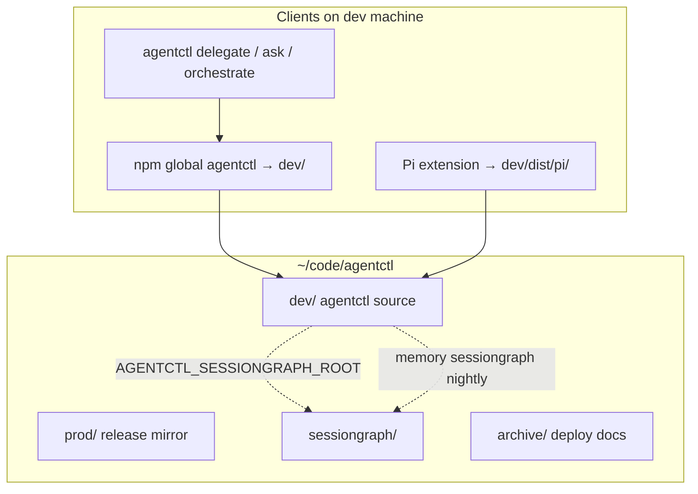
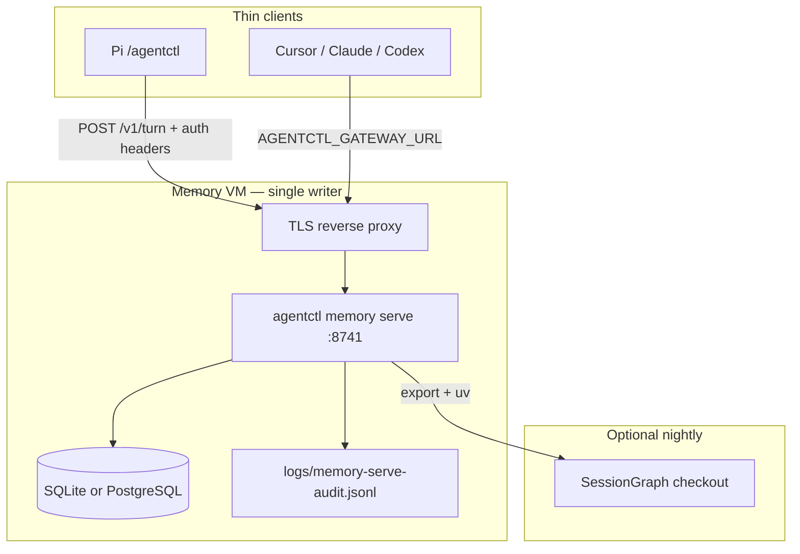

# agentctl stack

Local home for **agentctl** (CLI + team memory gatekeeper) and **SessionGraph** (usage analysis). Notes and runbooks live in **`~/code/atoz/`** — not in this folder.

| Path | Git remote | Role |
| --- | --- | --- |
| **`dev/`** | [LifeTimeScriptKiddie/agentctl](https://github.com/LifeTimeScriptKiddie/agentctl) | Daily development |
| **`prod/`** | same URL | **Public release mirror** — push / npm publish only from here |
| **`sessiongraph/`** | [LifeTimeScriptKiddie/sessiongraph](https://github.com/LifeTimeScriptKiddie/sessiongraph) | Session / memory-plane analysis (separate product) |
| **`archive/`** | local | Deploy templates → `archive/agentctl-memory-deploy/` |

**Public prod repo URL:** https://github.com/LifeTimeScriptKiddie/agentctl.git

---

## Architecture

### Local stack (this Mac / dev machine)



### Team memory (production pattern)

One **Linux VM** holds the database and **`agentctl memory serve`**. Laptops, Pi, and IDEs are **thin clients** — HTTP only for Q&A, not SSH per question.



**Rules agents must not violate**

| Do | Do not |
| --- | --- |
| Set **`AGENTCTL_GATEWAY_URL`** on clients for team Q&A | SSH **`agentctl memory remote`** for every question |
| Run **`memory serve`** on one VM with **`AGENTCTL_HOME`** | Open team SQLite on 30 laptops |
| Propose → **`/v1/memory/review`** → **`/v1/memory/accept`** | Commit team memory without human accept |
| Publish git/npm from **`prod/`** after promote | Push experimental work straight from **`dev/`** without review |

Deep deploy topology: **`archive/agentctl-memory-deploy/ARCHITECTURE.md`**. HTTP routes: **`dev/docs/INTEGRATIONS.md`**, **`dev/docs/TURN-GRAPH.md`**.

---

## Setup (step-by-step for agents)

Follow phases in order. **Stop** if verification fails; fix before the next phase.

### Phase 0 — Layout on disk

**Goal:** All stack repos exist under `~/code/agentctl/`.

1. Ensure directories exist:
   - `~/code/agentctl/dev`
   - `~/code/agentctl/prod`
   - `~/code/agentctl/sessiongraph`
   - `~/code/agentctl/archive`
2. Clone if missing:
   ```bash
   git clone https://github.com/LifeTimeScriptKiddie/agentctl.git ~/code/agentctl/prod
   git clone https://github.com/LifeTimeScriptKiddie/sessiongraph.git ~/code/agentctl/sessiongraph
   ```
3. **Verification:** `test -f ~/code/agentctl/dev/package.json && test -d ~/code/agentctl/sessiongraph/packages/sessiongraph`

---

### Phase 1 — Build and wire agentctl on the dev machine

**Goal:** `agentctl` on PATH points at **`dev/`**; tests pass.

1. ```bash
   cd ~/code/agentctl/dev
   npm install
   npm test
   npm run build
   ```
2. Link global CLI (optional but typical on MiniMac):
   ```bash
   npm link
   # or: ln -sf ~/code/agentctl/dev /opt/homebrew/lib/node_modules/agentctl
   ```
3. Pi extension (optional):
   ```bash
   ln -sf ~/code/agentctl/dev/dist/pi/agentctl.js ~/.pi/extensions/agentctl.ts
   ```
4. **Verification:**
   ```bash
   agentctl --help
   readlink -f "$(which agentctl)" 2>/dev/null || npm root -g
   cd ~/code/agentctl/dev && npm test
   ```
   Expect: help text; tests **pass** (460+).

---

### Phase 2 — Local memory smoke (single user, no VM)

**Goal:** Confirm memory slice works before team deploy.

1. ```bash
   export AGENTCTL_HOME="${AGENTCTL_HOME:-$HOME/.agentctl}"
   agentctl memory test
   ```
2. Optional gatekeeper on loopback:
   ```bash
   agentctl memory serve --host 127.0.0.1 --port 8741
   ```
   In another shell: `curl -s http://127.0.0.1:8741/health`
3. **Verification:** `memory test` exits 0; `/health` returns JSON with `"ok": true`.

Stop here if you only need routing/orchestration without team memory.

---

### Phase 3 — Memory VM (gatekeeper + store)

**Goal:** One Linux host runs **`agentctl memory serve`** with persistent **`AGENTCTL_HOME`**.

Use templates in **`archive/agentctl-memory-deploy/`** (`deploy/systemd/`, `deploy/env/server.env.example`, `ARCHITECTURE.md`).

1. Install Node ≥20 and built **agentctl** on the VM (from **`prod/`** or promoted **`dev/`**).
2. Create state dir:
   ```bash
   export AGENTCTL_HOME=/var/lib/agentctl/team
   mkdir -p "$AGENTCTL_HOME"/{config,logs}
   ```
3. **SQLite (default):** no extra backend env.
4. **PostgreSQL (optional):**
   ```bash
   export AGENTCTL_MEMORY_BACKEND=postgres
   export AGENTCTL_MEMORY_DATABASE_URL='postgres://…'
   agentctl memory postgres migrate
   ```
5. Install systemd unit from `archive/agentctl-memory-deploy/deploy/systemd/agentctl-memory-serve.service` (adjust paths).
6. Put TLS in front (Caddy example in `dev/docs/caddy-memory-gatekeeper.caddyfile.example`).
7. **Verification:**
   ```bash
   curl -s https://memory.example.com/health
   agentctl memory postgres status   # on VM, if using PG
   ```

---

### Phase 4 — Thin clients (Pi / IDE / scripts)

**Goal:** Workers pull JIT context from the VM; no local team DB.

On **each client** (not on the VM writer):

```bash
export AGENTCTL_GATEWAY_URL=https://memory.example.com   # or http://VM:8741 on lab LAN
export AGENTCTL_BRIEFING_WORKSPACE=team-your-workspace
export AGENTCTL_GATEWAY_TOKEN=…               # same value as AGENTCTL_SERVE_TOKEN on the VM
export AGENTCTL_USER_ID=alice
export AGENTCTL_GROUPS=eng,security          # optional
export AGENTCTL_CLEARANCE=internal           # optional
```

1. Ask via gatekeeper-backed delegate:
   ```bash
   agentctl delegate "What did we decide about X?"
   ```
2. Propose memory (HTTP):
   ```bash
   agentctl memory gateway write --workspace team-your-workspace \
     --text "Decision: …" --source "meeting 2026-09-22" --mode propose
   ```
3. Operator accept on VM or via gateway:
   ```bash
   agentctl memory gateway review --workspace team-your-workspace
   agentctl memory gateway accept --workspace … --id … --revision … --human-approved
   ```
4. **Verification:** delegate returns an answer or explicit abstain; review lists proposals; accept increments revision.

Pi: set the same env vars; use `/agentctl delegate …`, `/agentctl memory-review`, etc. See **`dev/docs/INTEGRATIONS.md`**.

---

### Phase 5 — SessionGraph nightly (modular, optional)

**Goal:** Nightly architecture recommendations from audit + store stats. SessionGraph is **not** vendored inside agentctl.

1. On the **memory VM** (or same host as serve):
   ```bash
   cd ~/code/agentctl/sessiongraph/packages/sessiongraph && uv sync
   export AGENTCTL_SESSIONGRAPH_ROOT=~/code/agentctl/sessiongraph
   export AGENTCTL_HOME=/var/lib/agentctl/team
   ```
2. Manual run:
   ```bash
   agentctl memory sessiongraph nightly --since 24h
   ```
3. Read outputs:
   - `$AGENTCTL_HOME/reports/sessiongraph/YYYY-MM-DD/report.md`
   - `…/suggest-agentctl/` (architecture sketch)
4. Optional timer: `archive/agentctl-memory-deploy/deploy/systemd/agentctl-sessiongraph-nightly.{service,timer}`
5. **Verification:** export JSON schema `sessiongraph.memory_plane.v1`; `report.md` contains findings.

Details: **`dev/docs/SESSIONGRAPH-NIGHTLY.md`**.

### Security

Memory serve trusts identity headers (`x-agentctl-user-id`, `x-agentctl-groups`,
`x-agentctl-clearance`) only behind a bearer token:

- **With `AGENTCTL_SERVE_TOKEN`:** every route except `GET /health` requires
  `Authorization: Bearer <token>`, and the caller's identity comes from the
  headers. Clients send the token by setting `AGENTCTL_GATEWAY_TOKEN` to the
  same value.
- **Without a token:** any request carrying an identity header gets 401
  `token_required_for_identity_headers`. The identity is the server's own
  `AGENTCTL_USER_ID` / `AGENTCTL_GROUPS` / `AGENTCTL_CLEARANCE`. If none is
  set, requests get 401 `identity_required` unless `AGENTCTL_SERVE_ALLOW_ANON=1`
  (trusted single-user local development only). Unset `AGENTCTL_USER_ID` on
  clients that talk to a token-less local server, or they will be refused.

`AGENTCTL_MEMORY_REVIEWER_GROUPS` restricts memory acceptance to callers in the
listed groups. `POST /v1/memory/write` with `mode: "commit"` additionally
requires that variable to be set and the caller to be in one of the groups
(else 403 `reviewer_required`); `human_approved: true` in the body is not
enough on its own. `AGENTCTL_SERVE_ALLOWED_ORIGINS` is a comma-separated origin
allowlist, and `AGENTCTL_SERVE_MAX_BODY` sets the request-body limit in bytes
(default 1 MiB). Non-loopback binds require `AGENTCTL_SERVE_TOKEN`. Clients
warn once on stderr when `AGENTCTL_GATEWAY_URL` is plain `http:` to a
non-loopback host; put TLS in front (Phase 3) so the token isn't sent in clear.

Agent config (`agents.yaml`) can replace any lane's command, health probe and
environment, so agentctl loads it only from `AGENTCTL_CONFIG` or
`$AGENTCTL_HOME/agents.yaml`. A repo-local `./agents.yaml` is skipped with a
warning until you review it and run `agentctl config trust`; editing the file
revokes trust. The read-only `claude` lane starts with `--strict-mcp-config`
and an empty MCP config, so user MCP connectors (mail, docs) are not loaded.

---

### Phase 6 — Release to GitHub / npm

**Goal:** Public **`main`** matches reviewed code.

1. Develop and test in **`~/code/agentctl/dev`**.
2. Promote reviewed changes into **`~/code/agentctl/prod`** (merge/cherry-pick/copy — no automatic sync).
3. ```bash
   cd ~/code/agentctl/prod
   npm test
   git push origin main
   npm publish   # when releasing @lifetimescriptkiddie/agentctl
   ```
4. **Verification:** https://github.com/LifeTimeScriptKiddie/agentctl/commits/main matches **`prod/`** HEAD.

---

## Environment reference

| Variable | Where | Purpose |
| --- | --- | --- |
| `AGENTCTL_HOME` | Memory VM | State root (DB, logs, exports) |
| `AGENTCTL_GATEWAY_URL` | Thin clients | Base URL for `/v1/turn` |
| `AGENTCTL_BRIEFING_WORKSPACE` | Clients | Workspace id for turns |
| `AGENTCTL_USER_ID` / `AGENTCTL_GROUPS` / `AGENTCTL_CLEARANCE` | Clients | Auth headers (honored only when the VM sets `AGENTCTL_SERVE_TOKEN`) |
| `AGENTCTL_GATEWAY_TOKEN` | Clients | Bearer token sent to the VM; must match `AGENTCTL_SERVE_TOKEN` |
| `AGENTCTL_SERVE_TOKEN` | VM | Bearer token required on every non-health route |
| `AGENTCTL_MEMORY_BACKEND` | VM | `sqlite` (default) or `postgres` |
| `AGENTCTL_MEMORY_DATABASE_URL` | VM | Postgres DSN |
| `AGENTCTL_SESSIONGRAPH_ROOT` | VM (nightly) | Path to sessiongraph git checkout |
| `AGENTCTL_SERVE_MODEL_AGENT` | VM | Optional central model on `/v1/turn` |

---

## Related paths

| What | Path |
| --- | --- |
| Notes vault | `~/code/atoz/` |
| MiniMac inventory | `~/code/atoz/Systems/minimac.md` |
| Orchestration flows | `dev/docs/FLOW-ARCHITECTURE.md` |
| Workspace rules for agents | `~/code/AGENTS.md` |

---

## QA (dev machine)

```bash
cd ~/code/agentctl/dev
npm test
node scripts/qa-gatekeeper-smoke.mjs   # if gatekeeper running locally
node scripts/qa-full.mjs               # full gate incl. optional Docker Postgres
```
